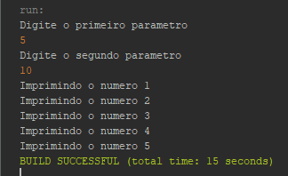

<h1 align="center">Validação Processo Seletivo:</h1>

## 📖 About the project
In this project, developed using the Java language, I implemented basic inputs with validations. These inputs result in an output, which is the difference between the 2nd parameter and the 1st parameter, both of which are inputs themselves. <br>
However, if the user enters the 2nd parameter smaller than the 1st, an error occurs, which is handled through a custom function. Nevertheless, this basic challenge is part of a DIO Bootcamp: Santander Bootcamp | Fullstack Developer.



## 🦾 Technologies used
<div style="display: flex;">
  


</div>

## 🤔 What i learned
- Basically, I just improved my skills in something I already know because this bootcamp challenge is a basic introduction to Error handling.
- I improved my skills in customized error handling.

## 👽 How to clone this project

````bash
    # Select where you want to clone
    $ cd ~/Documents/WHERE_YOU_WANT
````

````bash
    # Clone the project
    $ git clone https://github.com/DevGustavus/REPOSITORY_NAME.git
````

````bash
    # Check if cloning worked fine
    $ cd ~/Documents/DIRECTORY_LOCATION
    $ ls
````
